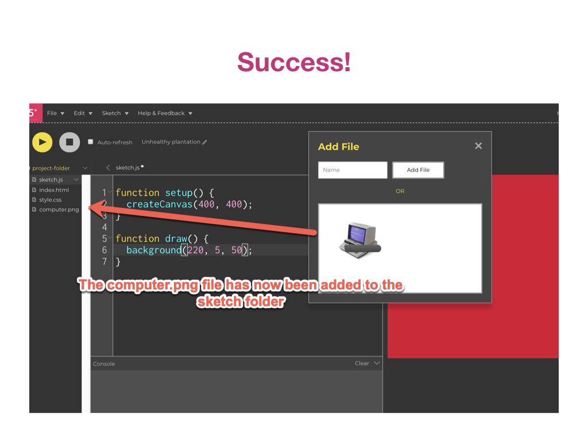
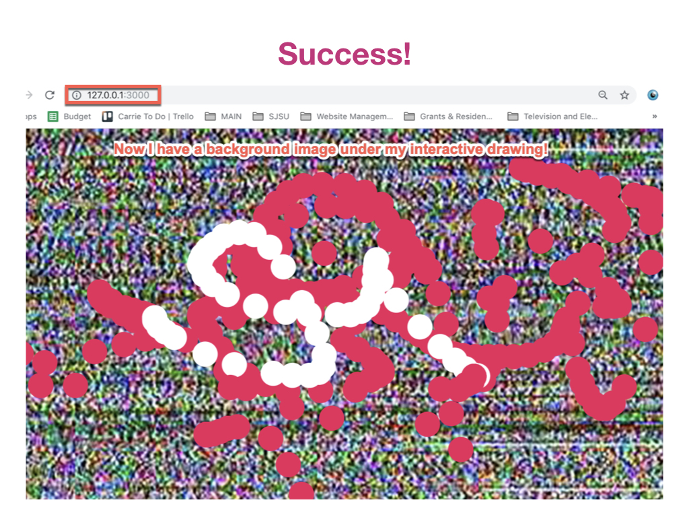

# **INTRO TO P5 & CODING- ADDING IMAGES!**

#### **Two Examples:**

[**Click for Full Website**](https://carriehott.github.io/code-art/)

[**Click for Full Website**](https://carriehott.github.io/codeart/)

#### **On this page:**
1. [One Image and PNGs](#one-image-and-pngs)
2. [Two Images and Backgrounds](#two-images-and-backgrounds)
3. [Putting Images in Your Website Sketch](#putting-images-in-your-website-sketch)

# One Image and PNGs

#### **Why a png file?** These files are like jpgs but they can keep a transparent background (jpgs cannot). So, if you want to have an object without a background in your sketch, make sure you have a transparent backrgound and save it as a png file.

# Two Images and Backgrounds

# Putting Images in Your Website Sketch

#### **Other Resources:**

* [p5js.org Image Reference](https://p5js.org/reference/#group-Image)
* [Allison Parrish's great tutorial on adding media in p5](https://creative-coding.decontextualize.com/media/)
* [Coding Train Video on Images-1](https://www.youtube.com/watch?v=rO6M5hj0V-o&list=PLRqwX-V7Uu6Zy51Q-x9tMWIv9cueOFTFA&index=33)
* [Coding Train Video on Images-2](https://www.youtube.com/watch?v=i2C1hrJMwz0&list=PLRqwX-V7Uu6Zy51Q-x9tMWIv9cueOFTFA&index=34)
